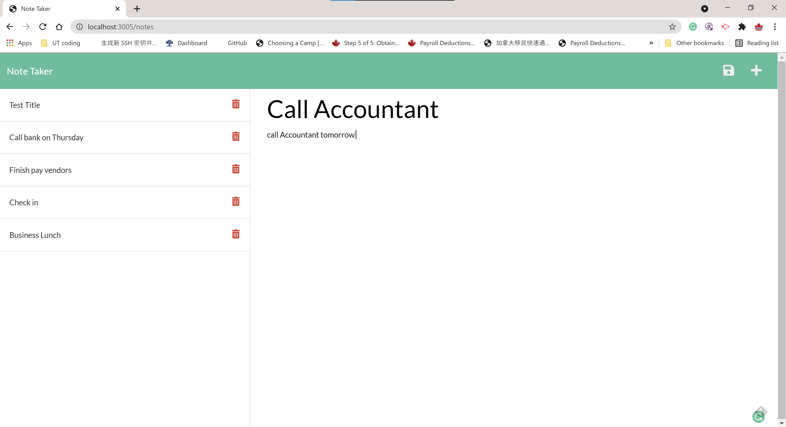

# Note Taker

## Description

Create an application called Note Taker used to write and save notes.

## Table of Contents

- [Installation](#installation)
- [Usage](#usage)
- [Contributing](#contributing)
- [Test](#tests)
- [License](#license)
- [Questions](#questions)

## Installation

npm init, npm i express

## Usage

npm express , node server.js

## Badges

N/A

## Contributing

N/A

## Tests

node server.js

## License

    This project is license under the MIT license.

If you have any question about license ,please visit to https://opensource.org/licenses/MIT.

## Questions

If you have any questions ,please check the link : https://github.com/billgeng/UT06-2021-BG-Challenge11

If you have any additional questions , please Email to me by billgeng@yahoo.com.
